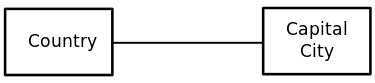

# Title: Data modeling

- Repository: `NA`
- Type of Challenge: `Learning challenge`
- Duration: `1 day`
- Deployment strategy : `NA`
- Team challenge : `3-5 learners`

## Learning objectives
- Convert use cases to UML diagrams
- Ability to find entities and their fields 
- Understand the different type of relations, and the ability to map them on a use case
- Understand what a primary & foreign key is
- Convert UML diagram to an SQL schema

## The mission
Data modeling is a process used to define and analyze data needed to support the business processes and needs with a technical solution.
In practice this means starting with business requirements (stories) and converting them to detailed database schedules.

Depending on the size of a project, this process might be done by technical analyst or a developer. Often the best results are achieved when working closely with the client to make sure your new implementation matches all questions the business can ask (use cases / business cases).

After reading and understanding the small use story, follow the following steps, and visualise the schema with a UML schema.

## Example: Becode classes
> Let us take a class in BeCode as example, which has students and a teacher, both are assigned to a class. You can have multiple students for a class, but only 1 (main) coach. We want to track the names of all people involved, and the location of each class. Each class has a name assigned to it. Coaches also have a special employee nummer related to their salary. For our statistics we also want to track the gender and age of all our students.

### What is UML and what is its purpose?
UML (Unified Modeling Language) is a modeling language used by software developers. UML can be used to develop diagrams and provide programmers and customers a shared language to discuss the plans for the program, before all the expensive programming has even started.

You have several types of charts like Flow charts, state diagrams and Object diagrams.

### Potential programs
- [staruml](https://staruml.io/) - Free and open source, can have multiple types of charts. You need the ERD for the exercise.
- The free chrome plugin [Gliffy Diagrams](https://chrome.google.com/webstore/detail/gliffy-diagrams/bhmicilclplefnflapjmnngmkkkkpfad), also allows multiple types of charts.
- [Visual paradigm](https://www.visual-paradigm.com/solution/freeumltool/) Commercial software with a free version that allows ERDs.

## Steps

### 1: Identify and list all the separate entities
We want to look out for Nouns in the description, here we can find "student", "teacher" and "class".
Anything that can be counted and tracked to fulfill the business needs are prime candidates.

### 2: Identify the important relationships that exist between the entities
Look for verbs like "belongs to", "has", "reports to" or "assigned to". 

For example, A teacher teaches students. Here, "teaches" is a relationship and this is the relationship between a Teacher entity and a Student entity. 

This result in the following list:

- Teacher -> class (1 to 1)
- Student -> class (many to 1)
- Teacher -> Student (1 to many)
   
### 2.5: What type of relation?
You also want to think what the type of the relation is.

There are three types of relationships that can exist between two entities.

- One-to-One Relationship: Very rare and often the sign of bad database design. Represented by a straigth line in UML.

- One-to-Many or Many-to-One Relationship: The most common relation. Represented by a arrow line pointing towards to side with the many side.

-  Many-to-Many Relationship: This requires an extra table in the middle to track the relation. Represented by a arrow line pointing both sides.

### 3: Identify the individual fields inside your entities, and their type (bool, int, varchar, ...)

- Teacher (name : varchar, employee id : unsigned int)
- Student (name : varchar, age: small unsigned int, gender: char(1))
- Class (address : varchar, name : varchar)

#### What is the difference between char() and varchar()?
- VARCHAR has a variable-length, the user could enter between one and ten thousand characters.
- CHAR has a fixed length. In our case, just one char for the gender(M,F,X). If your content is a fixed size, you'll get better performance with CHAR .

#### What does unsigned mean?
Each type of integer comes with each own range, for example an int can have up to 255 in value.
However, this is misleading because as a default it also allows negative numbers.
This means a small int is divide by 2, and the final range is -127 until +127.
Putting unsigned for it means not to track the "negative" sign, effectively doubling the range to the expected 255.
    
### 4: Find your primary (PK) and foreign keys (FK)
[Look at this video](https://www.youtube.com/watch?v=B5r8CcTUs5Y) to understand what a primary and foreign key is.

You need to find a piece of "unique" data and use this to link to another table.
This is a place where theory and practice often differ.

The theory would tell us that for example "student name" is a unique field, but in practise most developer would never use this as a PK. Imagine a student being named "jan janssens", the changes of a collision is too high. 

Because of this we will almost always use an integer that automatically increased by 1 for each record. You can compare it to an array, except this counter starts at 1). In your database software you did this by checking the "automatic increment" option.

This would make us end with:

- Teacher (name : varchar, employee id : unsigned int (PK))
- Student (student id: unsigned int (PK), name : varchar, age: small unsigned int, gender: char(1), class name: varchar (FK))
- Class (address : varchar, name : varchar, employee id (FK))

Pay attention to the end of the one to many ended up with the extra field.
Eg: One class can have multiple students.

### 5: Check model for duplicated date (redundancy)
Redundancy can occur on 2 levels, duplicated columns having the same info over multiple tables, and relations that are not needed.

The last relation with teacher->student can be removed, because both have a joined relation with class. You can answer the question "which teacher is responsible for which student", by passing trough the class table.

We don't have an example of redundant data in our small exercise, for example a problem could be having a "Teacher phone number" in the class table and a "phone number" field in the coach table.    

# Use cases
After this small example it is up to you to make an UML schema based on the scenarios below.
Try to think of reasonable questions the business might ask, but don't go into crazy inception level depth about it. Use common sense.

It can help to follow the steps we outlined above with the small example use case.

Only 1 person in the group needs to create the UML schema, the rest can participate in the group discussion.
Once the UML schema is done for all 3 use cases, your coach will join you to discuss your solution.

Once you are done with your UML schema and your coach has confirmed the schema, convert it to an SQL schema on your own computer.

## De lijn

The lijn owns a number of busses. Each bus is allocated to at least one route, but one bus can be used for multiple routes during the day, just never at the same timeslot.
One route can have multiple busses driving on it and each route passes through a number of stops. 

One or more drivers are allocated to each stage of a route, which corresponds to a journey through some or all of the towns on a route. 

Some towns have a garage where busses are kept during the night, and each of the busses are identified by the registration number and can carry different numbers of passengers, since the vehicles vary in capacity. 

Each route is identified by a route number. Drivers have an employee number, name, address, and sometimes a telephone number.

### Let us identify useful business cases together.
A business case is an answer to a specific question or need the company might have.

I will provide you with several example questions, for the next use cases I want you think of these questions yourself.

- Does every bus have a driver
- How many busses does a specific route use
- Where is bus X parked during the night
- What is the capacity of a certain route
- How long does it take to drive from village A to village B.

## Sales database
A company wants some software to manage their sales person who go on to road to sell the product (a subscription to their SAAS) to their customers.
One of the main reasons they want to invest is to process the commissions a sales person get when he sells the product, and for each month "their" customer keeps paying for the service.

Same sales people are employed by the company and have another employee as their manager. There are also freelance developers that only report once a year directly to the CEO.
The software should be able to calculate the monthly sum to pay to the account, after agreement of the CEO or the responsible manager. The salary is a combination of the transportation allowance (depending on if the salesmen has this in his contract), the salary (if employed), and the commission (also differs for each sales person).

There needs to a history of each payment slip once the software is in use, and it should display who signed off on it. 

A sales person can book travel to a specific prospect or customer, and can save basic information about the customer in the system. 

## Artist gallery
An Art house wants some new software to help them keep up to date with their artists, making it easy for them to generate biographies to put together with the displayed art.

For each piece of artwork they want to store the title and the artist.

On their site some art can be bid on by registered customers. The price always starts at 50% of a specified buy-out price and either goes to the highest bidder after 1 month not receiving a better offer or if somebody immediately pays the buy out price.

For each customer they keep their login (email+password), name, address, the total amount they already spent. It would be nice if the software could keep track of the interests of a specific customer, so they can sent target emails (always likes van Gogh, medieval paintings, ...)

For the art house it is really important they have a quick and flexible way of grouping several pieces of art together, for example by type (painting, photograph, statue), date (century, the 80's, ...), artist or subject (religious work, historical figure, war, abstract art). The more flexibel the better!

## Want more?
You can find a lot more of these type of challenges and their solutions on [https://www.wu.ac.at/erp/webtrainer/erm-webtrainer/exercise](https://www.wu.ac.at/erp/webtrainer/erm-webtrainer/exercise).